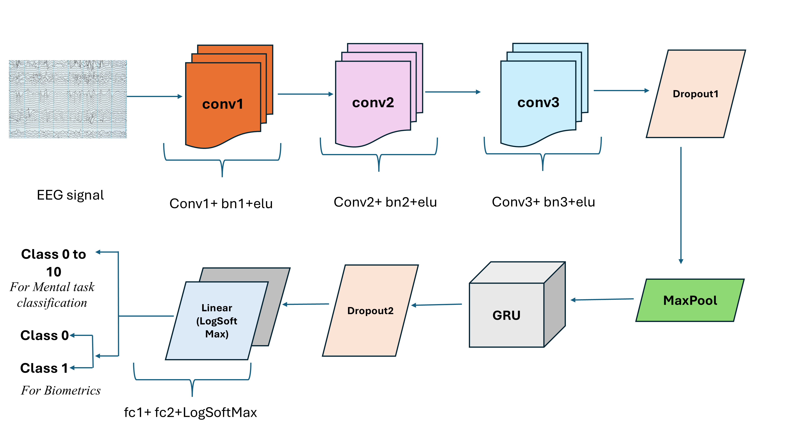

# BMT_EEG
This repository provides data and code for the paper entitled: "BMT_EEG: A Novel EEG Dataset to study the influence of novel protocol on mental task classification and authentication systems".
Here, we have developed model for Mental Task Classification and Biometric Authentication Systems. The architecture of the proposed model consisting of Convolutional Neural Networks(CNNs) and Gated Recurrent units (GRUs) is given below:

## Data collection
The EEG data were collected using 32 channels RMS device, with 256Hz sampling rate. 20 subjects (12 male and 8 female) data were collected in 3 different sessions. The subjects were asked to sit comfortably in a chair and complete the corresponding tasks with minimal unnecessary muscle movements. The single experiment took approximately 2 hours, which include obtaining written consent, providing instructions, placing electrodes, verifying impedance, recording data, and removing electrodes. The study protocol was approved by the Jamia Institutional Ethics Committee and was in accordance with the Declaration of Helsinki.
The description of various data recording protocols is given in data_description file. The sequence of data collection paradigm is illustrated in the below figure:

## Experiments
### For Mental Task Classification
We have performed multi-class classification, and classified the 11 tasks: 3 motor movement, 4 motor imagery, 2 baseline tasks (Resting state eyes open and closed) and 2 VEP tasks.

