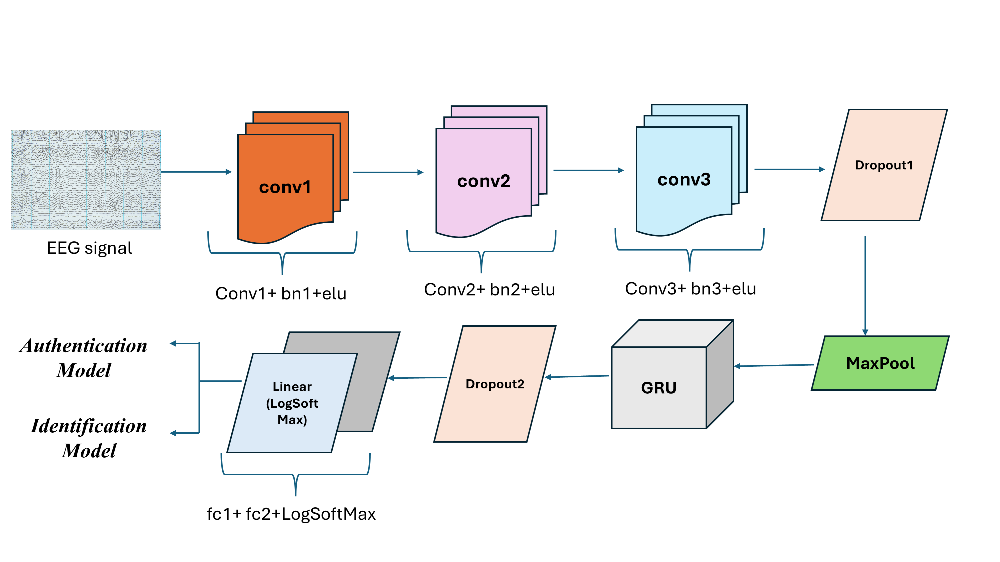
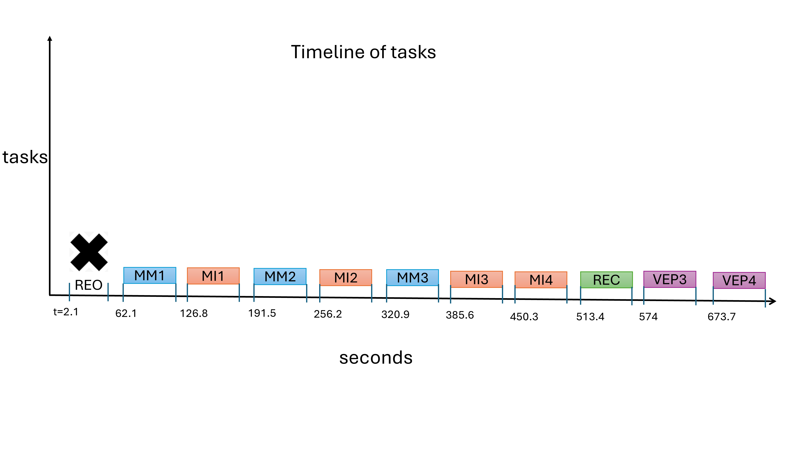
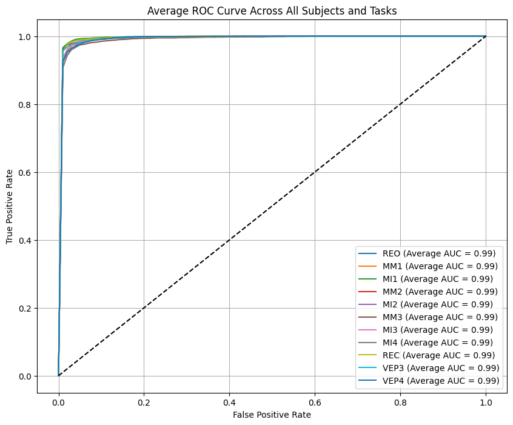
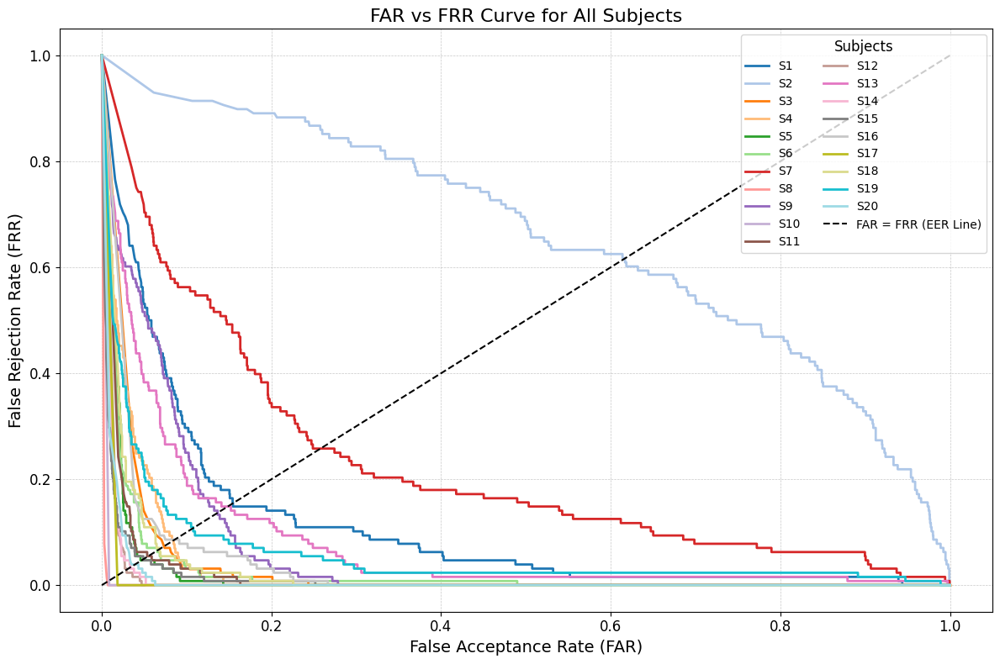
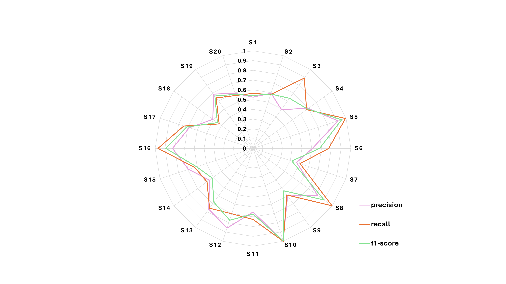

# BMT_EEG
This repository provides data and code for the paper entitled: "BMT_EEG: A Novel EEG Dataset to study the influence of novel protocol on mental task classification and authentication systems".
Here, we have developed model for Biometric Authentication and Identification Systems. The architecture of the proposed model consisting of Convolutional Neural Networks(CNNs) and Gated Recurrent units (GRUs) is given below:

## Data collection
The EEG data were collected from 20 subjects in 3 different sessions, using 32 channels RMS device where the electrodes are pasted according to the internatinal 10-20 system (see Figure below), with 256Hz sampling rate. The subjects were asked to sit comfortably in a chair and complete the corresponding tasks with minimal unnecessary muscle movements. The single experiment took approximately 2 hours, which include obtaining written consent, providing instructions, placing electrodes, verifying impedance, recording data, and removing electrodes. The study protocol was approved by the Jamia Institutional Ethics Committee and was in accordance with the Declaration of Helsinki.

    

The description of various data recording protocols is given in data_description file. The sequence of data collection paradigm is illustrated in the below figure:

The timeline of the data collection is illustrated below:

## Data Preprocessing
We have used EEGLAB toolbox for data preprocessing. We have performed removal of irrelevant channels which resulted in 20 channels (see Figure), re-referencing (average), FIR filter and ICA. The final components obtained after performing ICA are given below. The below picture represented the brain activity of the user while recording the data.

 

The dipole components are shown below:
\

## Experiments
For designing biometric authentication system for each subject, we utilized data from all of the 11 tasks of a user to build 11 foolproof and robust authentication systems. 
### Biometric Authentication: Random Forgery
For this experiment we have incorporated data from all the tasks. 
We have used **two sessions (first two sessions) for training and last session as test data for a particular subject**.
The positive samples of training data include data from, from instance, task VEP task, of a single subject which is our taget subject.
The negative samples of the training data include data from all the other tasks except VEP of all the other subjects (except target subject).
A similar approach is used for making postive and negative samples of the test data, except that the data is taken from third session only.
For random forgery, the average Equal Error Rate (EER) of 1.46% was achieved using Motor Imagery task 2 (MI2); best out of 11 stimuli recorded.
Code and results of this experiment is given in directory [bmt_exp](./bmt_exm).

### Biometric Authentication: Skilled Forgery
To evaluate how well the proposed BMT_EEG authentication system can handle the skilled forgery attacks, we included a threat model that closely simulates more informed impostor attempts. In this scenario, to simulate skilled forgery, the negative class or 'Forged' samples in the test set were constructed using **Session 3 data from the same task (VEP3) or a highly similar task (VEP4) performed by the remaining 19 users**.
For skilled forgery, the MI1 task yielded an average EER of 7.01%, demonstrating the resilience of the model to both naive and sophisticated imposters.
Code and results of this experiment is given in directory [skilled_forgery](./skilled_forgery).
### Biometric Identification
For implementing a closed-loop biometric identification system, a multi-class classification approach was adopted. One of the tasks e.g. MI2 was selected to train multi-class model using Train data from **first two sessions of all subjects and evaluated on Test data from their third session and non-MI2 task**. This session-wise separation between Train/Test dataset allowed to assess the model’s capability to generalize across multiple sessions while accurately identifying subjects based on their neural activity.
Code and results of this experiment is given in directory [identification](./identification).

## Results
We have given below the average results obtained for both the experiments as ROC plots and FPR vs FRR plot for all the 20 subjects.

#### Biometric authentication: Random Forgery

    

#### Biometric authentication: Skilled Forgery

    

#### Biometric Identification

    

