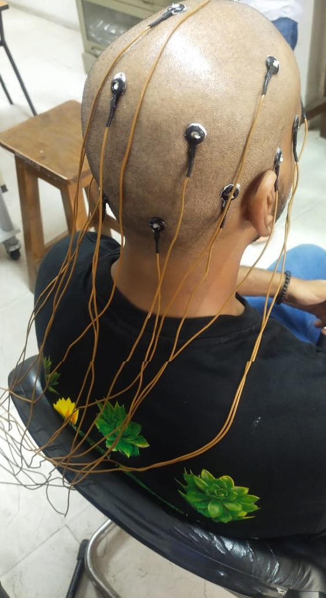
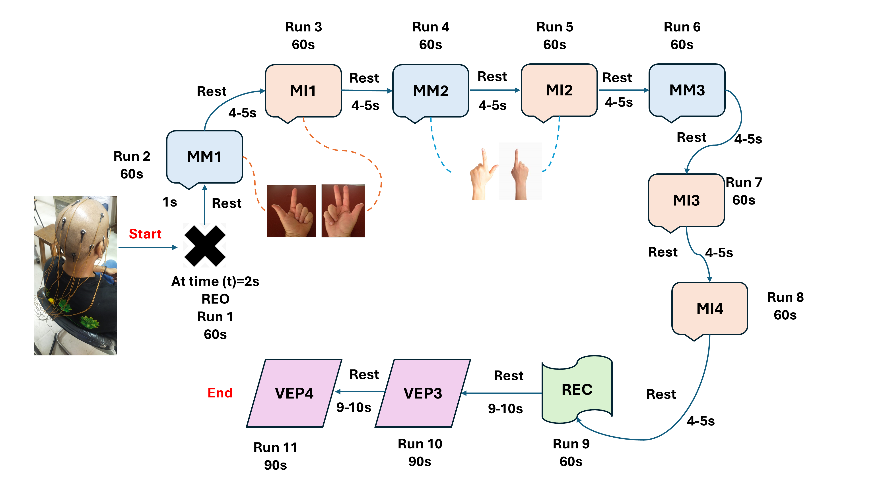
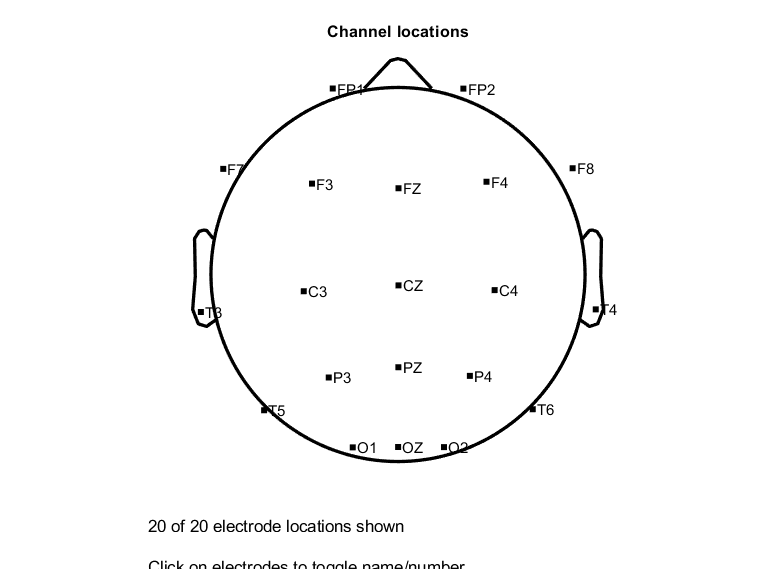
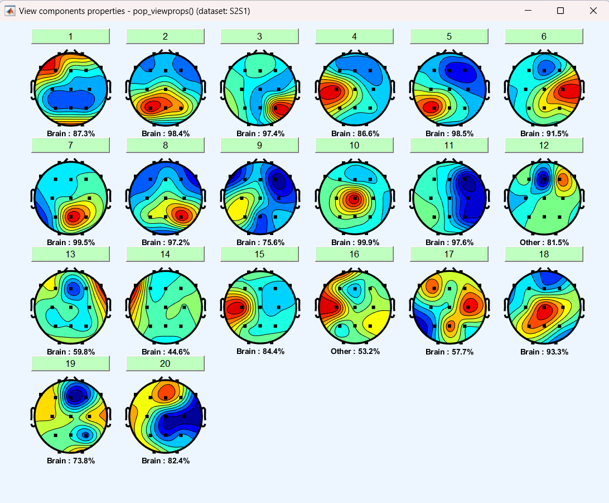
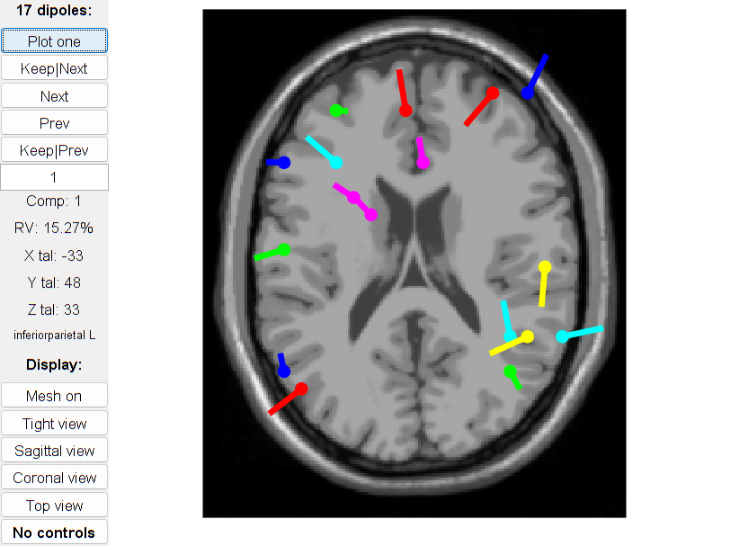

# BMT_EEG
This repository provides data and code for the paper entitled: "BMT_EEG: A Novel EEG Dataset to study the influence of novel protocol on mental task classification and authentication systems".
Here, we have developed model for Mental Task Classification and Biometric Authentication Systems. The architecture of the proposed model consisting of Convolutional Neural Networks(CNNs) and Gated Recurrent units (GRUs) is given below:

## Data collection
The EEG data were collected from 20 subjects in 3 different sessions, using 32 channels RMS device where the electrodes are pasted according to the internatinal 10-20 system (see Figure below), with 256Hz sampling rate. The subjects were asked to sit comfortably in a chair and complete the corresponding tasks with minimal unnecessary muscle movements. The single experiment took approximately 2 hours, which include obtaining written consent, providing instructions, placing electrodes, verifying impedance, recording data, and removing electrodes. The study protocol was approved by the Jamia Institutional Ethics Committee and was in accordance with the Declaration of Helsinki.

    

The description of various data recording protocols is given in data_description file. The sequence of data collection paradigm is illustrated in the below figure:

## Data Preprocessing
We have used EEGLAB toolbox for data preprocessing. We have performed removal of irrelevant channels which resulted in 20 channels (see Figure), re-referencing (average), FIR filter and ICA. The final components obtained after performing ICA are given below. The below picture represented the brain activity of the user while recording the data.

 

The dipole components are shown below:
\

## Experiments
### For Mental Task Classification
We have performed multi-class classification, and classified the 11 tasks: 3 motor movement, 4 motor imagery, 2 baseline tasks (Resting state eyes open and closed) and 2 VEP tasks. We have used 60-40 train-test split for a particular subject. The 60% training data was further divided into train and validation using 10 fold cross-validation.
Code and results of this experiment is given in directory [mtc_exp](./mtc_exp).

### For Biometric Authentication
For this experiment we have incorporated data for VEP task only. 
We have used **two sessions (first two sessions) for training and last session as test data for a particular subject**.
The positive samples of training data include data from VEP task only of a single subject which is our taget subject.
The negative samples of the training data include data from all the other tasks except VEP of all the other subjects (except target subject).
A similar approach is used for making postive and negative samples of the test data, except that the data is taken from third session only.
Code and results of this experiment is given in directory [bmt_exp](./bmt_exm).

